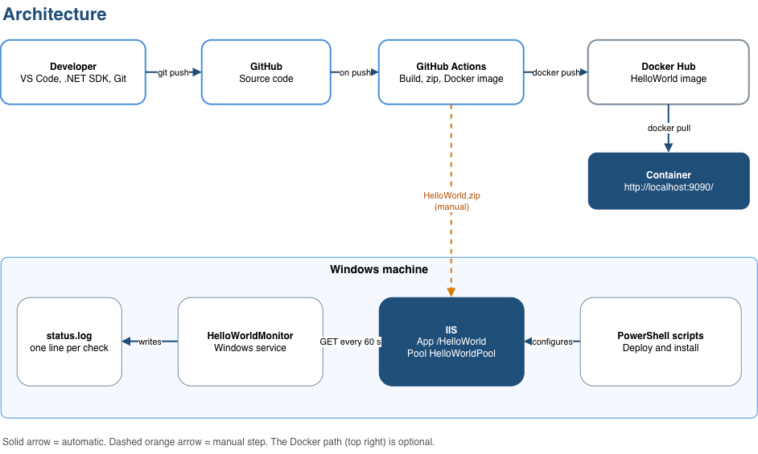

# Architecture

[← Back to README](./README.md)

## How it works

1. **Push:** the developer pushes code to GitHub.
2. **CI:** GitHub Actions builds the application, creates `HelloWorld.zip` and builds a Docker image, which it pushes to Docker Hub.
3. **IIS:** the zip is downloaded and extracted on the Windows machine (a manual step). The PowerShell scripts configure IIS and install the monitor.
4. **Monitor:** the HelloWorldMonitor service checks the site every 60 seconds and writes the result to `status.log`.
5. **Docker (optional):** the image is pulled from Docker Hub and runs as a container on port `9090`.

## Good to know

- The CI does not deploy. Copying the zip to IIS is manual (the dashed arrow).
- The monitor only watches the IIS site, not the container.
- IIS uses port `8080` and Docker uses `9090`, so both can run on the same machine.