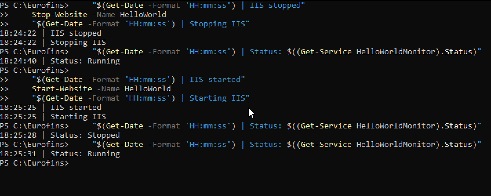
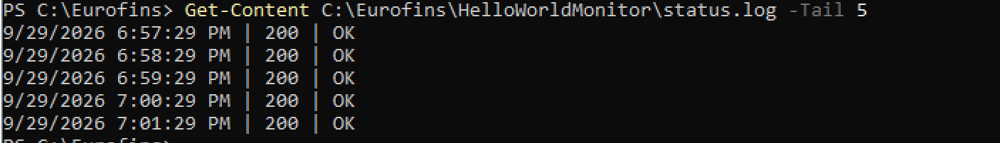

# Recovery test

[← Back to README](README.md)

## Purpose

The assignment requires the `HelloWorldMonitor` service to restart by itself 300 seconds after it stops. This page shows the test that proves the recovery works.

To avoid waiting five minutes, the delay was shortened to **10 seconds** for the test and restored to **300 seconds** afterwards. Only the number changes; the mechanism is the same.

## How the test was run

**1. Shorten the delay (test only):**

​```powershell
sc.exe failure HelloWorldMonitor reset= 86400 actions= restart/10000
​```

**2. Stop the IIS site.** The lines around the command print the time, so the screenshot has timestamps:

​```powershell
"$(Get-Date -Format 'HH:mm:ss') | Stopping IIS"
Stop-Website -Name HelloWorld
"$(Get-Date -Format 'HH:mm:ss') | IIS stopped"
​```

**3. Wait for the monitor's next check.** The monitor checks the site every 60 seconds. When it finds the site down, it exits and the service becomes `Stopped`. Windows then waits 10 seconds before restarting it.

A second PowerShell window was open with this command, which prints the service status every second:

​```powershell
while ($true) { "$(Get-Date -Format 'HH:mm:ss') | $((Get-Service HelloWorldMonitor).Status)"; Start-Sleep -Seconds 1 }
​```

It showed the moment the service stopped, so the site could be started again inside the 10-second recovery delay. This matters because the recovery restarts the monitor, not IIS. If the site is still down when the monitor restarts, it fails its first check and stops again.

**4. Start the site again:**

​```powershell
"$(Get-Date -Format 'HH:mm:ss') | Starting IIS"
Start-Website -Name HelloWorld
"$(Get-Date -Format 'HH:mm:ss') | IIS started"
​```

**5. Check the service status:**

​```powershell
"$(Get-Date -Format 'HH:mm:ss') | Status: $((Get-Service HelloWorldMonitor).Status)"
​```

**6. Restore the required delay and check it:**

​```powershell
sc.exe failure HelloWorldMonitor reset= 86400 actions= restart/300000
sc.exe qfailure HelloWorldMonitor
​```

The `FAILURE_ACTIONS` line must end with:

```text
RESTART -- Delay = 300000 milliseconds.
```

## Result



| Time | What the screenshot shows |
|---|---|
| 18:24:22 | The IIS site is stopped |
| 18:24:40 | The service is still `Running`: the monitor has not run its next check yet |
| 18:25:25 | The IIS site is started again, inside the 10-second recovery delay that follows the monitor's failed check |
| 18:25:28 | The service is `Stopped`: it is waiting for the 10-second recovery delay |
| 18:25:31 | The service is `Running` again: Windows restarted it by itself |

The screenshot shows the order and the times of the commands. The 10-second gap between the service stopping and restarting was observed in the second window.

### Log check

After the recovery, the monitor keeps checking the site every 60 seconds and logs the result:

```powershell
Get-Content C:\Eurofins\HelloWorldMonitor\status.log -Tail 5
```



The five lines are one minute apart, and all show `200 | OK`.

## What it shows

- The service does not stop the moment IIS goes down. It stops at the monitor's next 60-second check.
- After it stops, Windows does not restart it immediately. It waits for the configured delay, then restarts it without any manual action.
- The test used a 10-second delay. The final configuration is 300 seconds, as required.